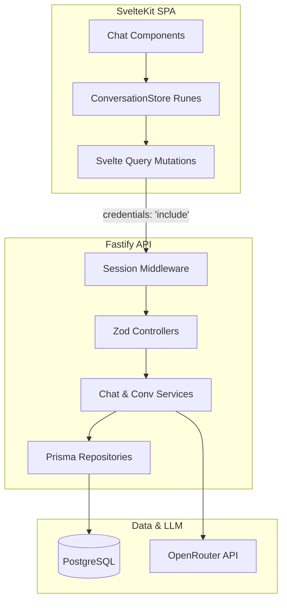

# Helio - AI Customer Support Agent

## Live Demo

* **Frontend Application:** [https://helio-chat.netlify.app](https://helio-chat.netlify.app)
* **Backend API:** [https://helio-5cog.onrender.com](https://helio-5cog.onrender.com)

---

## Overview

Helio is an automated customer support assistant custom-built for e-commerce. It uses an AI agent loaded with store policies and catalog details to answer questions instantly. The project implements persistent, anonymous, cookie-based sessions so users can access their chat history across browser reloads without registering.

---

## Features

* **Anonymous Session Tracking:** Uses a secure cookie-based session token (`chat_session`) to isolate and persist user conversation threads without forcing registration or sign-ins.
* **Thread Management:** Features conversational context loading, dynamic thread creation, and sidebar list navigation.
* **E-Commerce Specific Support:** System prompt instructions guide the AI to answer shipping, returns, contact, and inventory inquiries only from a defined product catalog, using fallback recommendation lists when requests are out-of-scope.
* **Polished UI/UX:** Responsive layout built using Svelte 5 and SvelteKit, featuring collapsible desktop sidebars, mobile drawer sheets, optimistic user message status indicators, and Markdown-rendered bubbles.
* **Simulated Streaming:** Implements client-side word-by-word animation to mimic typing feedback, improving the perceived latency and readability of responses.

---

## Tech Stack

### Frontend

* **Core Framework:** Svelte 5, SvelteKit
* **State Management:** Svelte 5 Runes (`$state`, `$derived`, `$effect`)
* **API Caching & Fetching:** Svelte Query (`@tanstack/svelte-query`)
* **Styling:** TailwindCSS v4
* **Markdown Parser:** `marked`
* **Icons:** `lucide-svelte`, `phosphor-svelte`
* **Components:** `shadcn-svelte`, `bits-ui`

### Backend

* **Core Framework:** Fastify
* **Language & Runtime:** TypeScript, Node.js (via `tsx`)
* **Database ORM:** Prisma Client (`@prisma/client`)
* **Request Validation:** Zod
* **AI SDK:** `openai` (targeting OpenRouter)
* **Middlewares & Plugins:** `@fastify/cookie`, `@fastify/cors`

### Database & Deployment

* **Local Database:** PostgreSQL (in Docker container)
* **Production Database:** Neon PostgreSQL
* **Frontend Hosting:** Netlify
* **Backend Hosting:** Render

---

## Architecture Overview

The system is split into a static, client-side single-page application (SPA) and a stateless REST API server.



* **Frontend Architecture:** Handles all user interface elements, local conversation state (e.g. streaming status and message collections), and client-side page transitions. Svelte Query performs backend API queries, automatic caching, and invalidations. API calls send session cookies automatically by enabling the `credentials: "include"` property.
* **Backend Architecture:** A modular Fastify server organized into Controllers (HTTP mapping and validation), Services (business logic, transactions, and external integrations), and Repositories (database abstraction).
* **Separation of Concerns:** The SvelteKit client operates purely inside the browser, decoupling user interfaces from database layers. The backend hides internal data storage layouts and LLM credentials, exposing clean HTTP APIs.
* **Request Lifecycle & Data Flow:**
  1. A user submits a query via the frontend text area.
  2. The client records the message optimistically with a `"sending"` status and creates an assistant placeholder in a `"streaming"` status.
  3. A POST request is fired to the `/chat` route.
  4. Fastify's session middleware interceptor reads or generates the `chat_session` cookie and verifies the session in PostgreSQL.
  5. The controller validates parameters with Zod.
  6. The service checks conversation scope, writes the user message to PostgreSQL, loads the message thread history, and sends it to OpenRouter.
  7. OpenRouter generates and returns the complete text completion.
  8. The service writes the assistant response to PostgreSQL, and returns it.
  9. Svelte Query updates the cache, and the client progressively appends the words to the screen at a 30ms interval.

---

## Database Design

The database stores application data in three primary tables:

* **Session:** Tracks active, anonymous user sessions. A Session holds a one-to-many relationship with Conversations.
* **Conversation:** Tracks distinct discussion threads. Each Conversation is owned by a single Session and holds a one-to-many relationship with Messages.
* **Message:** Records specific chat bubbles, noting the sender's role (user or assistant), text content, and creation timestamp. Every Message belongs to a single Conversation.

---

## API Endpoints

* **`GET /health`**
  * **Purpose:** Basic system health check. Returns `200 OK`.
* **`GET /conversations`**
  * **Purpose:** Retrieves all conversation threads belonging to the active session.
* **`GET /conversations/:id`**
  * **Purpose:** Fetches the full message history of a single conversation after verifying session ownership.
* **`POST /conversations`**
  * **Purpose:** Spawns a new conversation thread under the active session (accepts an optional custom title).
* **`POST /chat`**
  * **Purpose:** Submits a user message, persists it, queries OpenRouter, saves the agent's reply, and returns the message.

---

## LLM Notes

* **Provider & Client:** OpenRouter API connected via the standard `openai` library with `baseURL` set to `https://openrouter.ai/api/v1`.
* **Model Configuration:** Determined by the `OPENROUTER_MODEL` environment variable.
* **Prompting Strategy:** 
  * The backend prepends a system prompt from `support-agent.prompt.ts` containing the rules and catalog data.
  * Rules prohibit the assistant from fabricating policies, recommending off-catalog products, or identifying itself as an AI instructions follower.
  * If context cannot be matched, it apologizes and dynamically outputs 3–5 follow-up questions from the catalog details.
* **Context Handling:** To maintain conversational context, previous messages belonging to the active conversation are loaded from PostgreSQL and included in requests sent to the LLM alongside the system prompt. Responses are contextual and not generated solely from the latest user message.

---

## Session Management

* **Creation:** Handled by the backend `sessionMiddleware` registered on request lifecycle hooks. If no `chat_session` cookie is found, the server generates a UUID session ID and inserts it into the PostgreSQL `Session` table.
* **Persistence & Cookie Configuration:** Cookies are named `chat_session` with a lifespan of 30 days. Options include `httpOnly: true`, `path: '/'`, and automatic SSL toggles (`sameSite: 'none'` and `secure: true` in production).
* **Ownership Verification:** The API validates that the `sessionId` extracted from the request cookie matches the `sessionId` recorded in the conversation thread database row, throwing `403 Forbidden` if unauthorized.

---

## Error Handling & Validation

* **Validation:** Zod schemas reject invalid requests (e.g. empty message bodies, invalid UUID parameters) returning `400 Bad Request`.
* **Access Control:** Verifies conversation ownership, returning `403 Forbidden` if session IDs mismatch.
* **Not Found Statuses:** Yields `404 Not Found` if a query checks nonexistent sessions or conversation IDs.
* **Third-Party Failures:** Catches API faults from OpenRouter, returning a `502 Bad Gateway`.
* **Client Fallback:** If the network or server fails, Svelte stores flag the message as `"error"` and render an alert message suggestion block.

---

## Assumptions

* **Model Generation Parameters:** Model behavior currently relies on the provider's default generation parameters. No custom temperature, `max_tokens`, or `top_p` limits are configured by the application.
* **Input Testing Coverage:** The application was tested using multi-paragraph inputs exceeding 2,000 characters and 300+ words to verify message persistence, conversation history loading, rendering behavior, and AI response generation.

---

## Local Development Setup

### Prerequisites

* Node.js (v18 or higher)
* Yarn package manager
* Docker & Docker Compose (for running local database instance)

### Environment Variables

Configure `.env` files in both directories based on the example templates:

#### Backend (`backend/.env`)

```env
DATABASE_URL=
DIRECT_URL=
OPENROUTER_API_KEY=
OPENROUTER_MODEL=
NODE_ENV=
ALLOWED_ORIGIN=
```

#### Frontend (`frontend/.env`)

```env
PUBLIC_API_URL=
```

### Database Setup

1. Spin up the local database container:
   ```bash
   docker compose up -d
   ```
2. Navigate to backend and apply the migrations:
   ```bash
   cd backend
   yarn db:migrate
   ```
3. Generate the Prisma Client:
   ```bash
   yarn db:generate
   ```

### Backend Setup

1. Install dependencies:
   ```bash
   cd backend
   yarn install
   ```
2. Start the dev server:
   ```bash
   yarn dev
   ```

### Frontend Setup

1. Install dependencies:
   ```bash
   cd frontend
   yarn install
   ```
2. Start the development server:
   ```bash
   yarn dev
   ```

### Running the Application

* **Start Backend Dev Server:** `yarn dev` (runs tsx watch)
* **Build Backend Code:** `yarn build` (runs tsc)
* **Start Backend Production Server:** `yarn start` (runs node dist/server.js)
* **Start Frontend Dev Server:** `yarn dev` (runs vite dev)
* **Build Frontend Site:** `yarn build` (runs vite build)
* **Preview Frontend Site:** `yarn preview` (runs vite preview)

---

## Deployment

* **Frontend Platform:** Netlify (deployed at [https://helio-chat.netlify.app](https://helio-chat.netlify.app))
* **Backend Platform:** Render (deployed at [https://helio-5cog.onrender.com](https://helio-5cog.onrender.com))
* **Database Platform:** Neon PostgreSQL

---

## Design Decisions

* **Session-based persistence instead of authentication:** The application maintains message isolation and user threads via request cookies instead of user credentials. This removes login friction for user testing while preserving session history.
* **Service/Repository Architecture:** Separation of database management (repositories) and runtime features (services) ensures code maintainability and decouples Fastify routing rules.
* **PostgreSQL Usage:** Structured, relational schemas map relationships between sessions, conversations, and messages with transactional updates ensuring ACID properties during writes.
* **Optimistic UI updates:** The frontend updates the messaging layout immediately upon submission (status: `sending`) before the backend confirms API delivery, reducing perceived latency.
* **Conversation persistence strategy:** Message records are linked to conversations in the database. When a new message is saved, the conversation's `updatedAt` field is updated inside a database transaction to keep conversation orders accurate.

---

## Redis Considerations

Redis was intentionally not implemented for this assignment.

The application currently persists conversations and messages in PostgreSQL, which is sufficient for the expected scale of the take-home project.

Introducing Redis would add additional infrastructure and operational complexity without providing significant benefits for the current workload.

In a production-scale version of Helio, Redis would be a strong candidate for:

* Conversation caching
* Session caching
* Frequently accessed conversation history
* Rate limiting
* Queue management
* AI response caching

For the scope of this assignment, PostgreSQL alone provides a simpler architecture while still meeting all functional requirements.

---

## Trade-offs

### Simulated Streaming Instead of Real Streaming

To provide a more natural chat experience, the application simulates streaming responses on the frontend. After the backend receives the complete response from the LLM, the frontend progressively renders the content word-by-word to mimic a typing effect.

This approach improves the perceived responsiveness of the chat interface while keeping the implementation simple and reliable for the scope of the assignment.

A true streaming implementation would involve receiving partial response chunks directly from the LLM provider and forwarding them to the client in real time. This could be achieved using technologies such as:

* Server-Sent Events (SSE)
* WebSockets
* Streaming HTTP responses using Readable Streams

These approaches would allow users to see the AI response as it is being generated token-by-token rather than waiting for the complete response before rendering begins.

For the scope of this assignment, simulated streaming was chosen as a simpler solution that provides a similar user experience without introducing the additional complexity of real-time communication infrastructure.

---

## Future Improvements

* **Rename conversations:** Add side controls on Svelte sidebar elements to rename conversation titles in the database.
* **Delete conversations:** Add cascades and delete triggers in Prisma schemas to allow deleting threads and associated message records.
* **Redis caching layer:** Deploy a memory cache to store conversation threads and database lookups, easing load on PostgreSQL.
* **AI-generated conversation titles:** Use OpenRouter to generate concise conversation titles based on initial message context.
* **Real streaming responses:** Transition the Fastify endpoint and Svelte fetch client to use Server-Sent Events (SSE) or WebSockets to display tokens directly as they are compiled.
* **Retrieval-Augmented Generation (RAG):** Integrate a vector database to search and fetch relevant context from larger knowledge bases or product catalogs dynamically.
* **Conversation search:** Add a search text box to query messages and conversation history by keywords.
* **Rate limiting:** Limit HTTP endpoint requests per session to secure the server and prevent LLM API billing abuses.
* **Multi-channel integrations:** Connect the Fastify messaging engine to external interfaces such as SMS, email, or Slack.
* **Analytics and reporting:** Build dashboard reports to monitor agent performance, user sessions, and common unresolved requests.

---

## Screenshots

### Desktop

| Landing Page | Create Conversation |
| --- | --- |
|  |  |

| New Conversation | Active Conversation |
| --- | --- |
|  |  |

### Mobile

| Home | Sidebar | New Conversation | Create Modal | Active Chat |
| --- | --- | --- | --- | --- |
|  |  |  |  |  |


---

## Project Structure

```
.
├── README.md
├── docker-compose.yml
├── backend/
│   ├── .env.example
│   ├── .gitignore
│   ├── package.json
│   ├── tsconfig.json
│   ├── yarn.lock
│   ├── prisma/
│   │   ├── schema.prisma
│   │   └── migrations/
│   └── src/
│       ├── app.ts
│       ├── server.ts
│       ├── config/
│       │   └── env.ts
│       ├── constants/
│       │   ├── error-messages.ts
│       │   └── success-messages.ts
│       ├── controllers/
│       │   ├── chat.controller.ts
│       │   └── conversation.controller.ts
│       ├── db/
│       │   └── prisma.ts
│       ├── middleware/
│       │   └── session.middleware.ts
│       ├── plugins/
│       │   ├── cookie.ts
│       │   └── cors.ts
│       ├── prompts/
│       │   └── support-agent.prompt.ts
│       ├── repositories/
│       │   ├── conversation.repository.ts
│       │   ├── message.repository.ts
│       │   └── session.repository.ts
│       ├── routes/
│       │   ├── chat.route.ts
│       │   ├── conversation.route.ts
│       │   └── health.route.ts
│       ├── schemas/
│       │   ├── chat.schema.ts
│       │   └── conversation.schema.ts
│       ├── services/
│       │   ├── chat.service.ts
│       │   ├── conversation.service.ts
│       │   └── session.service.ts
│       ├── types/
│       │   ├── chat.ts
│       │   ├── conversation.ts
│       │   └── message.ts
│       └── utils/
│           └── generateSessionId.ts
└── frontend/
    ├── .env.example
    ├── .gitignore
    ├── .npmrc
    ├── package.json
    ├── svelte.config.js
    ├── tsconfig.json
    ├── vite.config.ts
    ├── yarn.lock
    └── src/
        ├── app.d.ts
        ├── app.html
        ├── hooks.server.ts
        ├── lib/
        │   ├── index.ts
        │   ├── utils.ts
        │   ├── api/
        │   │   ├── chat.ts
        │   │   ├── conversation.ts
        │   │   └── health.ts
        │   ├── assets/
        │   │   └── favicon.svg
        │   ├── components/
        │   │   ├── ChatInput.svelte
        │   │   ├── ConversationLayout.svelte
        │   │   ├── CreateConversationDialog.svelte
        │   │   ├── EmptyConversation.svelte
        │   │   ├── Loader.svelte
        │   │   ├── MessageItem.svelte
        │   │   ├── MessageList.svelte
        │   │   ├── Sidebar.svelte
        │   │   └── ui/
        │   ├── queries/
        │   │   ├── chat.ts
        │   │   └── conversation.ts
        │   ├── services/
        │   │   ├── chat.ts
        │   │   ├── conversation.ts
        │   │   └── utils.ts
        │   ├── stores/
        │   │   └── conversation.store.svelte.ts
        │   ├── types/
        │   │   ├── api.ts
        │   │   ├── conversation.ts
        │   │   ├── message.ts
        │   │   └── store.ts
        │   └── utils/
        │       └── env.ts
        └── routes/
            ├── +error.svelte
            ├── +layout.svelte
            ├── +page.svelte
            ├── layout.css
            └── c/
                ├── +page.svelte
                └── [conversationId]/
                    └── +page.svelte
```

---

## License

This project is licensed under the [MIT License](https://github.com/ArNAB-0053/helio/blob/main/LICENSE).
